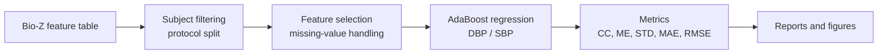
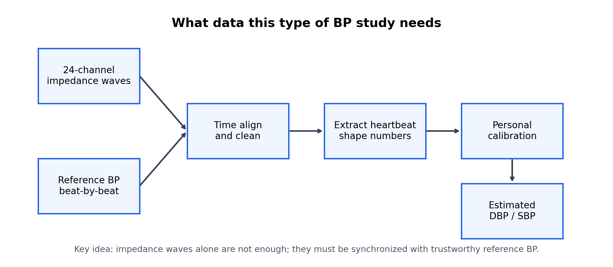
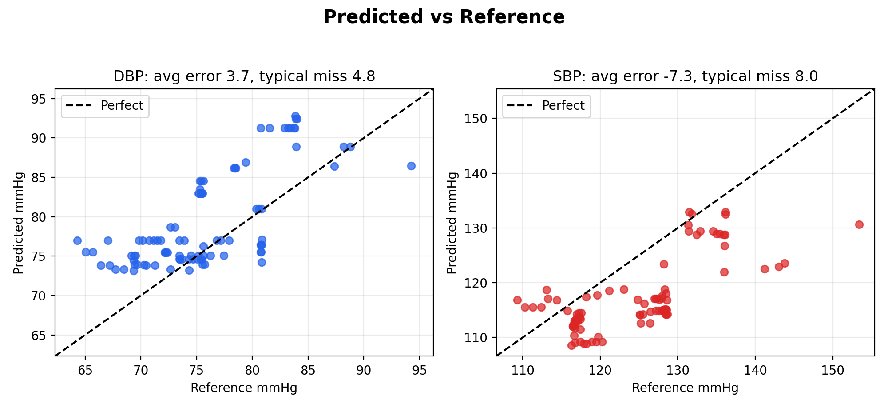
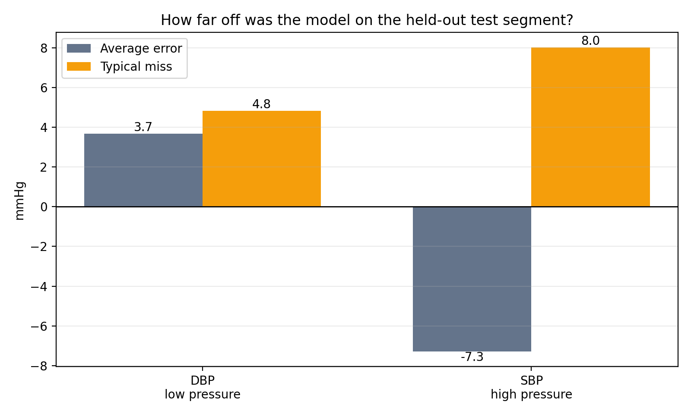

# Graphene BP Reproduction

[](https://github.com/zitai030302-tech/graphene-bp-reproduction/actions/workflows/checks.yml)

Modern feature-level reproduction of a Bio-Z blood-pressure estimation pipeline with AdaBoost regression, protocol-based evaluation, and leakage sensitivity checks.

This project reproduces the feature-level machine learning workflow from the public Graphene_BP codebase while updating the runner for current `pandas` and `scikit-learn` versions. It focuses on experiment design, preprocessing, model evaluation, and reproducibility rather than hardware fabrication or raw-signal processing.

## Highlights

- Modernized the original feature-level workflow for current Python scientific packages
- Reproduced subject-specific AdaBoost regression experiments for SBP/DBP
- Implemented the seven protocol settings encoded in the upstream experiment design
- Added a safer `train_only` imputation mode to inspect preprocessing leakage sensitivity
- Generated summary metrics, prediction plots, and a documented analysis report

## Pipeline



## Subject-generalization benchmark

A separate runner now compares mean prediction, Ridge, random forest, and AdaBoost under random row splits, subject-held-out splits, and leave-one-subject-out evaluation. Imputation is fitted on each training fold; Ridge scaling is also fold-local. Hyperparameters are fixed rather than selected on the held-out predictions.

```bash
python scripts/benchmark_models.py --synthetic --output /tmp/bioz-benchmark
python -m unittest discover -s tests -v
```

For a real feature CSV, specify the target and feature columns explicitly:

```bash
python scripts/benchmark_models.py --csv features.csv --target SBP --features feature_a,feature_b --group-column subject_id --output results/model_benchmark
```

The runner saves fold membership and held-out predictions so its metrics can be checked. Target columns and subject identifiers are rejected as features. Random splitting is included as a comparison; it does not demonstrate generalization to unseen subjects or prevent overlap between adjacent signal windows. LOSO addresses subject overlap, not every temporal leakage risk.

The [generated-cohort summary](results/synthetic_model_benchmark/summary.csv) is a software fixture, not a result on the Graphene_BP dataset. The original reproduction workflow and its reported metrics are preserved below.

## Figures







## Quick Start

Install dependencies:

```bash
python -m venv .venv
source .venv/bin/activate
pip install -r requirements-modern.txt
```

Download the public upstream assets:

```bash
python scripts/download_assets.py
```

Run a smoke reproduction:

```bash
python scripts/run_reproduction.py --smoke
python scripts/summarize_results.py results/smoke
```

Run the leakage-sensitivity variant:

```bash
python scripts/run_reproduction.py --smoke --imputer train_only --output-dir results/smoke_train_only_imputer
python scripts/summarize_results.py results/smoke_train_only_imputer
```

Run the full matrix:

```bash
python scripts/run_reproduction.py --training-select all --subjects 1,2,3,4,5,6 --output-dir results/full
python scripts/summarize_results.py results/full
```

## Example Smoke Results

Faithful global-imputation mode:

| Target | Split | CC | MAE | RMSE |
| --- | --- | ---: | ---: | ---: |
| DBP | test | 0.704 | 4.825 | 5.803 |
| SBP | test | 0.708 | 8.021 | 9.361 |

Train-only imputation sensitivity mode:

| Target | Split | CC | MAE | RMSE |
| --- | --- | ---: | ---: | ---: |
| DBP | test | 0.699 | 7.683 | 8.502 |
| SBP | test | 0.754 | 7.309 | 8.853 |

## Repository Layout

```text
docs/       pipeline analysis, reproduction log, Chinese reports
results/    selected summary CSVs and generated figures
scripts/    download, reproduction, summarization, and figure scripts
```

## Sources

- Upstream codebase: https://github.com/TAMU-ESP/Graphene_BP
- Paper page: https://www.nature.com/articles/s41565-022-01145-w
- PhysioNet data page: https://physionet.org/content/bp-graphene-bioimpedance/1.0.0/

Upstream code and data are not redistributed in this repository. Use `scripts/download_assets.py` to fetch the public assets needed for reproduction.

## Notes

- The project reproduces feature-level modeling from pre-extracted features.
- It does not rebuild graphene patch fabrication, analog front-end acquisition, raw impedance demodulation, filtering, peak detection, or clinical validation.
- The leakage-sensitivity mode is intended for evaluation hygiene, not as a claim that the original research result is invalid.


