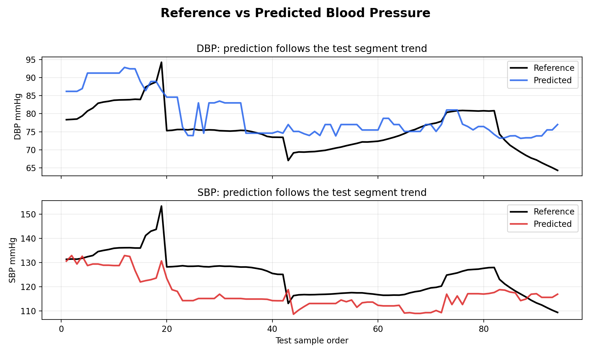

# Graphene_BP 复现结果简短汇报

面向：不熟悉机器学习细节的组会汇报  
日期：2026-05-21

## 1. 我们做了什么

这篇文章想解决的问题是：不用袖带，只用贴在颈部附近的阻抗信号，连续估计血压。

我们这次没有复现硬件和原始信号处理，而是先复现最核心的一段：

```text
已经提取好的阻抗波形特征
    -> 输入模型
    -> 输出舒张压 DBP 和收缩压 SBP
    -> 和参考血压比较误差
```

可以把它理解成：文章已经把每一次心跳整理成一组数字，我们检查这些数字能不能预测血压。

## 2. 用了哪些数据

本次使用公开仓库中已经整理好的特征表：

- 共 `29809` 条样本。
- 本次测试先选了 `subject 1`。
- 输入特征 `54` 个。
- 测试段是运动后的血压变化片段，共 `94` 个测试点。

这是一次小规模验证，目的是确认流程能跑通，并观察结果是否和论文报告在同一量级。

## 3. 这类工作真正需要什么数据

这类血压估计工作最关键的不是先选什么模型，而是先把数据采对。至少需要下面几类数据：

| 数据 | 为什么需要 |
| --- | --- |
| 多通道阻抗波形 | 这是输入，相当于“看到血管搏动”的信号 |
| 可靠参考血压 | 这是答案，用来告诉模型每一段信号对应多少血压 |
| 统一时间戳 | 阻抗和血压必须对齐，否则学到的是错位关系 |
| 电极和通道编号 | 每个通道来自哪两个电极，后面才能判断哪个位置有效 |
| 接触质量记录 | 贴片松动、汗液、接触阻抗变化都会影响结果 |
| 实验动作标签 | 静息、运动后、憋气、姿态变化等要分清楚 |

一个直观流程如下：


特别要注意：如果只有偶尔一次的袖带血压，只能做比较粗的校准；如果想做连续血压变化，最好有逐搏或高时间分辨率的参考血压。

## 4. 这些数据具体怎么处理

可以把处理过程理解成 8 步：

1. 先做硬件校准，确认每个通道测到的阻抗不是电路或接触问题。
2. 连续采集 24 通道阻抗波形，同时记录参考血压。
3. 用统一时间戳把阻抗信号和参考血压对齐。
4. 去掉明显坏段，比如掉线、饱和、剧烈运动伪迹。
5. 在波形里找到每一次心跳对应的起伏。
6. 对每次心跳提取简单数字，例如时间差、峰谷幅度、面积、上升下降形状等。
7. 把连续若干次心跳做平均，减少单次心跳噪声。
8. 对每个人单独建立“阻抗特征到血压”的对应关系，再用没参与训练的数据测试。

这篇文章公开给我们的不是最原始波形，而是已经处理到第 6 到第 7 步之后的特征表。所以本次复现验证的是“特征到血压”这一段。

## 5. 对 AD5940 + 4x6 电极 + 24 通道实验的启发

我们的 AD5940 + 4x6 电极阵列实验，可以从这篇文章得到几个非常具体的设计建议。

第一，24 通道的价值在于找空间信息。不同电极组合看到的血管搏动强弱不一样，不要一开始假设 24 个通道都同等有用。实验记录里必须保存：

- 电极坐标，例如第几行第几列。
- 激励电极和测量电极是哪一对。
- 每个通道的采样时间。
- 每个通道的接触质量或基线阻抗。

第二，如果 24 通道是通过开关轮询采集，要特别注意时间错位。血压脉搏是随时间变化的，如果 24 个通道不是同时采，而是依次扫出来的，就要记录每个通道的真实采样时刻。若扫完整个 24 通道太慢，建议先减少通道数，优先保留脉搏最清楚的几组电极。

第三，实验不能只采静息。建议每个受试者至少包含：

- 静息 3 到 5 分钟。
- 运动后恢复过程。
- 憋气或 Valsalva 类动作。
- 坐站或姿态变化。
- 重新贴一次电极后的重复测试。
- 如果条件允许，再做跨天重复。

第四，参考血压要尽量连续。如果没有连续参考血压，至少要清楚标记每次袖带测量的准确时间；但这种情况下，只适合验证趋势或校准，不适合声称逐搏连续血压。

第五，建议我们自己的原始数据表至少保存这些字段：

| 类别 | 建议保存内容 |
| --- | --- |
| 原始信号 | 时间戳、通道号、实部/虚部或幅值/相位 |
| 电极信息 | 4x6 位置、激励电极、测量电极 |
| 硬件设置 | 激励频率、电流档位、增益、采样率 |
| 参考血压 | SBP、DBP、测量时间、设备类型 |
| 实验标签 | 静息、运动后、憋气、姿态、重新贴片 |
| 质量信息 | 接触阻抗、是否掉线、是否运动伪迹 |

一句话说，对我们的实验来说，先不要急着追求复杂模型。第一阶段最重要的是把“24 通道阻抗波形 + 准确时间戳 + 可靠参考血压 + 清楚实验标签”采完整。

## 6. 结果直观看

下面这张图把测试段里的参考血压和模型预测画在一起。黑线是真实参考值，彩色线是模型预测值。



直观观察：

- 舒张压 DBP 的变化趋势基本能跟上，但整体有些偏高。
- 收缩压 SBP 的变化趋势也能跟上，但整体偏低更明显。

下面这张图看每个测试点的预测是否接近真实值。虚线越接近，说明预测越准。


可以看到点不是完全贴着虚线，但整体不是乱散的，说明阻抗特征里确实有和血压相关的信息。

## 7. 数字结果

| 指标 | 舒张压 DBP | 收缩压 SBP |
| --- | ---: | ---: |
| 测试点数 | 94 | 94 |
| 平均偏差 | +3.67 mmHg | -7.29 mmHg |
| 平均绝对误差 | 4.83 mmHg | 8.02 mmHg |
| 均方根误差 | 5.80 mmHg | 9.36 mmHg |

更直观一点：


解释：

- DBP：平均高估约 `3.7 mmHg`，一般误差约 `4.8 mmHg`。
- SBP：平均低估约 `7.3 mmHg`，一般误差约 `8.0 mmHg`。
- 论文摘要中报告的误差波动约为 DBP `4.5 mmHg`、SBP `5.8 mmHg`。我们当前小测试里的误差波动接近这个量级，但平均偏差还比较明显。

## 8. 一个重要发现

我们发现原仓库默认的数据处理方式有一个风险：在训练前填补缺失值时，它用了整张表的信息，包括测试集。

我们改成更严格的做法：只用训练集的信息来填补缺失值。结果如下：

| 做法 | DBP 平均误差 | DBP 平均绝对误差 | SBP 平均误差 | SBP 平均绝对误差 |
| --- | ---: | ---: | ---: | ---: |
| 原仓库类似做法 | +3.67 | 4.83 | -7.29 | 8.02 |
| 更严格做法 | +7.36 | 7.68 | -6.92 | 7.31 |

这说明结果对数据处理方式比较敏感。后续我们自己的项目，评估时一定要保证测试数据不参与任何训练前处理。

## 9. 对我们项目的启发

这篇文章最值得借鉴的不是某个“高级算法”，而是完整思路：

1. 不只看一个血流时间差，而是从阻抗波形中提取多种形状信息。
2. 每个人最好先做个体化校准，因为不同人的血管、贴片位置、皮肤接触都不同。
3. 数据采集时必须让血压真的变化起来，只采安静状态很难训练出可靠模型。
4. 后续评估不能只随机打乱数据，要做跨时间段、跨天、重新佩戴后的测试。

## 10. 当前结论

本次复现说明：

- 公开特征到血压预测的流程已经跑通。
- 阻抗特征确实包含血压相关信息。
- 当前小测试结果和论文报告在误差波动上接近，但平均偏差还不能忽略。
- 这个方向值得继续做，但后续必须重视数据采集协议和严格评估。

一句话总结：

> 这条路线不是“用模型直接猜血压”，而是先把阻抗波形中和血管搏动有关的信息提出来，再通过个体化校准去追踪血压变化；它有希望，但成败很大程度取决于采集协议和评估是否严格。
